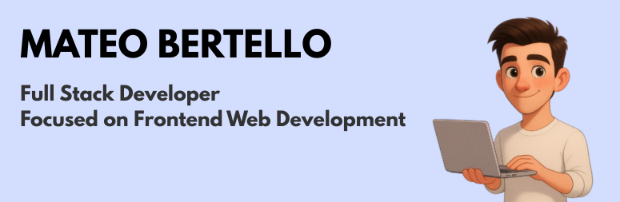

<h1 align="center">Hi, I'm Mateo Bertello </h1>

  

---

### 👋 About Me

I'm a **Full-Stack Developer** focused on **frontend** and based in **Rosario, Argentina**. I’m passionate about building intuitive, scalable, and user-centric web applications.

- 🧠 **Self-taught**, detail-oriented, and responsible.
- 🚀 Love turning ideas into clean, pixel-perfect interfaces.
- 🛠️ Working with **React, Astro, JavaScript, Sass, Node.js, Sequelize, PostgreSQL, Redis**, and more.

---

### 🏆 Featured Project

**[Futbolar](https://futbolar.com.ar)** – A social platform with real-time forums for football fans.  
✅ 200+ users • Built entirely by me using React, Node, WebSockets, and PostgreSQL.

---

### 🧠 Tech Stack

#### 🚀 Frontend
 
  
  
  
  
  
  
  
  
  

#### 🔧 Backend
 
  
  
  
  
  

#### 🛠️ Tools

  
  
  
  
  

---

### 📈 GitHub Stats

---
<!--### 🌱 Currently Learning

- UI/UX design principles
- Advanced frontend architecture
- Performance optimization

----->

### 📬 Contact Me

