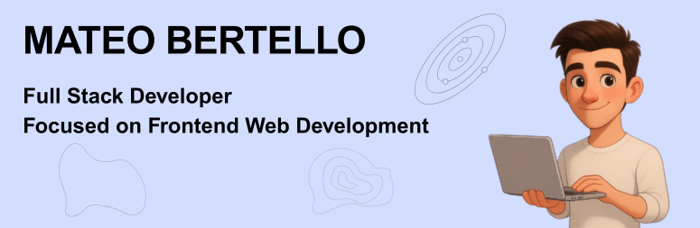

<h1>Hi , I'm Mateo Bertello </h1>

👋 Hi! I'm Mateo Bertello, a full-stack developer with a strong focus on frontend. I'm based in Rosario, Santa Fe, Argentina, and I'm passionate about building websites that are functional, intuitive, and well-structured.

🎯 I specialize in turning ideas and mockups into pixel-perfect websites, paying close attention to detail to achieve clean, cohesive, and efficient results.

💻 I work with modern technologies like JavaScript, React, Astro, and Sass, and I have a solid backend foundation using Node.js, Sequelize, PostgreSQL, and Redis.

🧠 I'm self-taught, responsible, and detail-oriented. I like to deeply understand what needs to be done and find the most effective way to get it done. I'm a fast learner and highly adaptable.

🚀 My featured project is "Futbolar", a social platform with real-time forums for football fans. It has over 200 registered users and was fully developed by me. Link: https://futbolar.com.ar

🌱 My goal is to keep growing as a developer, join challenging teams, and contribute to products that make a real impact. I'm especially interested in UI design, web performance, and frontend architecture, and I'm always open to exploring new technologies and creative approaches.

# 🧠 Skills:

<h4> Frontend Technologies</h4>
 
  
  
  
  
  
  
  
  
  

<h4> Backend  Technologies</h4>
 
  
  
  
  
  

<h4>Tools</h4>

  
  
  
  
  

# 📊 GitHub Stats:

# 🌐 Contact me

